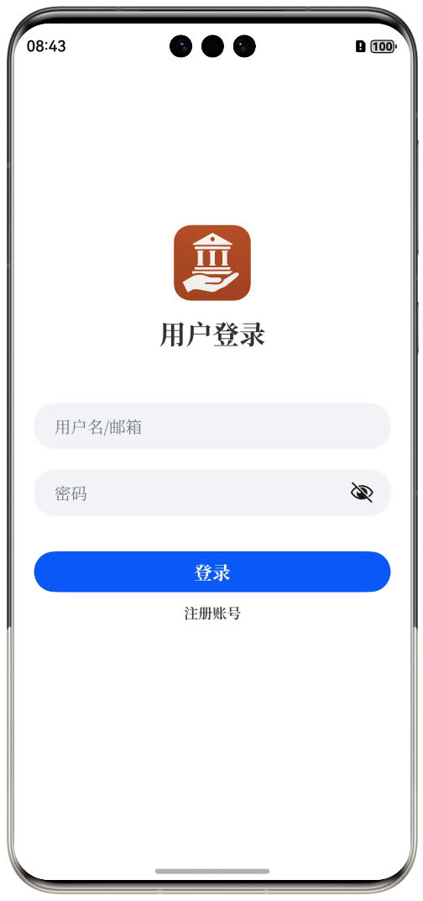
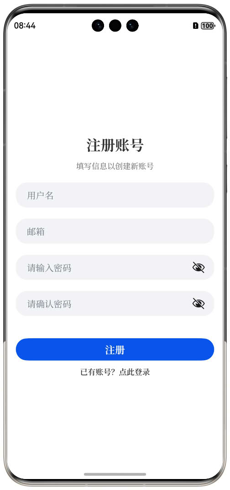
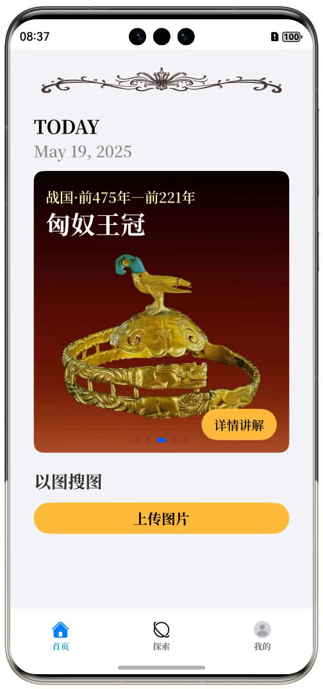
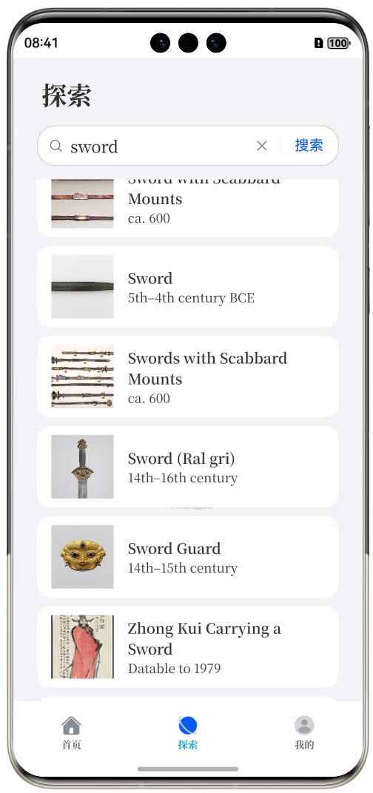
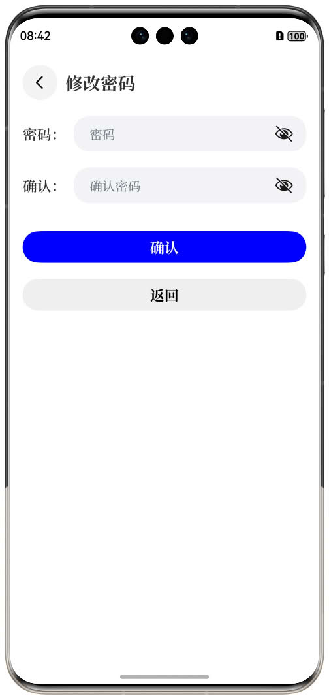
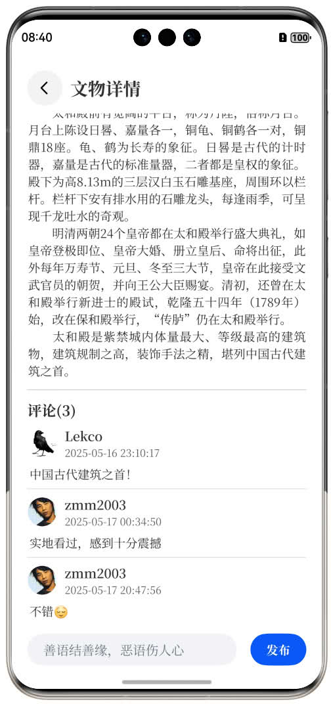

# 掌上博物馆移动端测试文档

## 一、需求背景

“掌上博物馆”是一款专为历史与文物爱好者打造的移动应用，它将传统博物馆的展览体验浓缩到手机屏幕之中，让用户在碎片化的时间里也能沉浸于文化的魅力。依托后台知识图谱技术，应用内涵盖瓷器、玉器、青铜器、中国画等典型单类文物，通过高清图文的方式，帮助用户随时随地了解每件藏品背后的故事。同时，融合类似微博的动态分享功能，鼓励用户发布观展感悟，点赞、评论和收藏他人的精彩瞬间，真正实现“边看边聊，边玩边学”。

## 二、测试范围

本轮测试重点覆盖以下模块：

1. **欢迎页面**：动画展示、初始化逻辑、跳转时机。
2. **登录与注册**：手机号/邮箱登录、注册。
3. **首页文物列表**：关键词搜索、列表滚动。
4. **文物详情**：图片展示、文字说明，跳转到源网页。
5. **以图搜图**：拍照与选图流程、结果展示。
6. **个人中心**：我的收藏、我的评论、账号设置。
7. **通用功能**：网络异常提示、错误页面、资源加载容错。

## 三、测试环境

- **设备**：HarmonyOS模拟器&设备
- **网络**：Wi-Fi、4G/5G、无网络三种环境
- **版本**：App v1.0.0、后台服务 API v1.0
- **工具**：DevEco Studio（真机调试）

## 四、测试策略与方法

1. **功能测试**：手动执行针对每个功能点的正向流程与异常流程用例，确保核心业务无漏测。
2. **兼容性测试**：在多品牌、多分辨率、多系统版本的机型上进行回归测试，验证界面适配与性能一致性。
3. **性能测试**：针对首页加载、文物查询等关键场景，测量响应时长并与设计指标对比。
4. **安全与稳定性测试**：模拟网络抖动、中断、接口超时，检查错误提示与重试机制；检查本地缓存和账号登录安全性。
5. **可用性与无障碍测试**：检查触控区域、色彩对比和按钮交互体验。

## 五、测试项与用例

### 5.1 登录与注册

- **用例 1**：注册页输入合法邮箱和符合规则的密码，点击“注册”后提示“注册成功”并跳转到欢迎页。

- **用例 2**：注册页输入格式非法的邮箱（如 user@com），点击“注册”后邮箱字段下方显示“请输入有效的邮箱地址”。

- **用例 3**：登录页输入已注册邮箱和正确密码，点击“登录”后跳转到个人中心并显示登录状态。

- **用例 4**：登录页输入已注册邮箱和错误密码，点击“登录”后显示“邮箱或密码错误，请重试”提示。

- **用例 5**：登录/注册页邮箱或密码任意一项为空时，无法登录或注册。

- **用例 6**：登录页点击“👁️”图标后，密码字段在掩码和明文之间切换显示。

- **用例 7**：网络断开时在登录或注册页填写合法信息并提交，弹出错误提示。

### 5.2 首页文物列表

- **用例 1**：首页轮播图默认展示第一张文物，向左/右滑动时可切换图片，底部指示点状态随之更新。
- **用例 2**：在轮播图上点击“详情讲解”按钮，应跳转到对应文物的详情讲解页面。
- **用例 3**：在“以图搜图”区域，点击“上传图片”按钮，应弹出系统相册或文件选择对话框。
- **用例 4**：上传一张有效图片后，应触发以图搜图流程，并在搜索结果页展示相关文物列表。
- **用例 5**：页面顶部日期（“May 19, 2025”）应与系统当前日期一致，并随日期变化自动更新。
- **用例 6**：底部导航栏点击“探索”图标，应切换到探索页；点击“我的”图标，应切换到个人中心页；点击“首页”图标，应回到首页。
- **用例 7**：网络较慢或资源加载中时，轮播图和上传按钮处应显示加载状态或占位，加载完成后内容平滑渲染无闪烁。

### 5.3 文物详情

- **用例 1**：点击页面左上角“←”返回按钮，应返回到上一页（首页或搜索结果页）。
- **用例 2**：页面标题应显示“文物详情”，主标题应为“故宫太和殿”，且与数据一致。
- **用例 3**：文物主图加载完成后，应正确显示，并在网络较慢时先展示占位图，加载完成后平滑切换；加载失败时显示默认错误占位图。
- **用例 4**：点击主图右上角心形点赞按钮，点赞数应+1，再次点击应取消点赞并恢复原始数量；刷新页面后点赞状态和数量应保持。
- **用例 5**：点击“源网页”按钮，应打开系统浏览器并跳转到该文物的原始网页地址。
- **用例 6**：文物属性区应完整展示“作者”、“背景”、“年代”、“分类”、“材质”、“尺寸”六项信息，且格式与后台数据一致。
- **用例 7**：详解文字区域应支持上下滚动，文字排版清晰，标题“详解”加粗且与正文有明显层次；长文本加载时应有滚动条且无卡顿。

### 5.4 文物搜索

- **用例 1**：在搜索框输入关键词（如sword），点击“搜索”后，列表正确返回并展示包含该关键词的文物条目。
- **用例 2**：在搜索框输入关键词后，点击输入框右侧“×”清除按钮，应清空输入内容并恢复默认列表或空状态。
- **用例 3**：列表滑动时，各条目图片占位图与实际图交替加载平滑，无闪烁和卡顿。
- **用例 4**：点击任意搜索结果条目，应跳转到对应文物的详情页，且标题、图片与预期一致。
- **用例 5**：搜索无匹配结果时，应显示“未找到相关文物”提示，并提供“重新搜索”或清空输入的操作入口。
- **用例 6**：在网络断开或接口异常时，点击“搜索”后应弹出错误提示，并可重试。

### 5.6 个人中心

- **用例 1**：记录查询保证低延迟，数据正确。
- **用例 2**：个人资料编辑后返回个人中心即时刷新更新；头像和用户名更改生效。
- **用例 3**：网络异常时加载个人中心数据，应在列表区域显示错误提示，并提供“重试”按钮；重试后成功恢复显示。
- **用例 4**：底部导航栏在个人中心高亮“我的”图标，点击其他图标可正确切换至“首页”和“探索”页面。

### 5.7 文物评论

- **用例 1**：在文物详情页评论输入框输入合法内容（如“非常精美！”），点击“发送”后，评论列表新增该条评论，并滚动到最新位置。
- **用例 2**：评论输入框输入为空或仅为空格，点击“发送”后，发送按钮保持禁用或显示“请输入评论内容”校验提示，无法提交。
- **用例 3**：评论中包含表情、链接或特殊字符时，应正确渲染表情图标、可点击链接，并对恶意脚本进行转义防护。
- **用例 4**：网络异常或服务器错误时，点击“发送”后应弹出“发布失败”提示，并保留输入内容以便重试。

## 六、性能测试

- **首页首屏加载**：≤ 2s
- **详情页打开**：≤ 300ms
- **语音播放启动**：≤ 200ms
- **图像检索延迟**：≤ 500ms

使用专业性能测试工具记录并对比设计目标，若偏差超过 10%，需定位原因并优化。

## 七、安全测试

- 检查本地缓存数据是否加密存储，不能被其他应用直接读取。
- 模拟常见攻击（SQL 注入、XSS、CSRF）确保无漏洞。

## 八、测试里程碑

|阶段|内容|
|-|-|
|用例编写与评审|完成所有测试用例编写并与开发同步评审|
|环境搭建与冒烟测试|部署测试环境，执行冒烟测试，确保环境可用|
|功能测试与缺陷修复|按模块执行测试、提交缺陷、回归验证|
|性能&安全专项测试|重点测试性能指标与安全漏洞，并进行报告|
|测试报告与上线评审|完成测试总结报告，与产品、开发、运维召开评审会|
