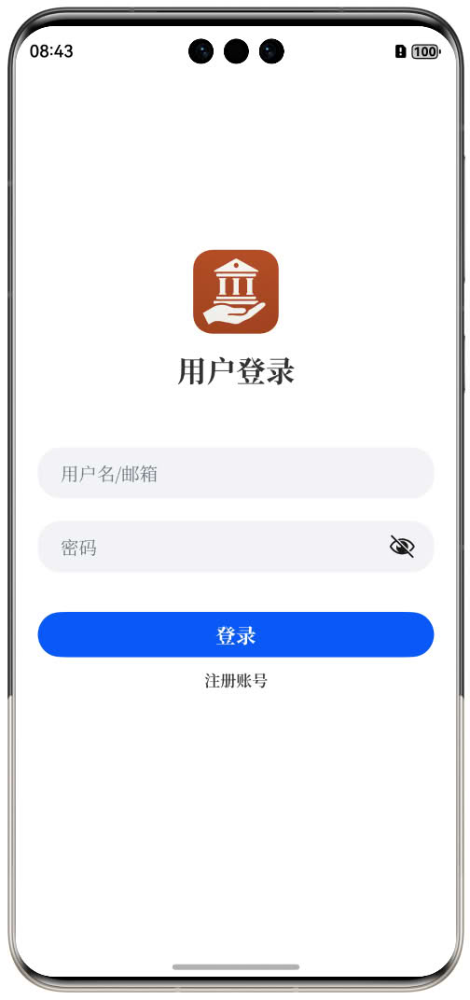
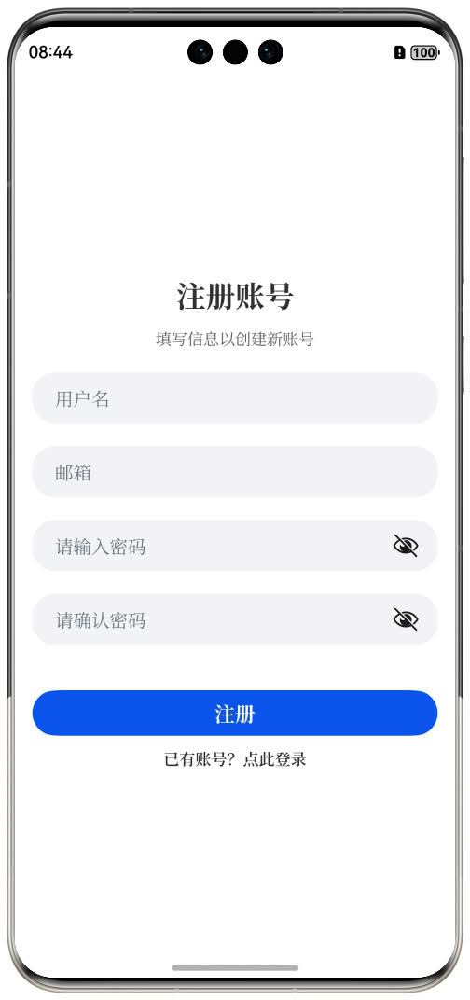
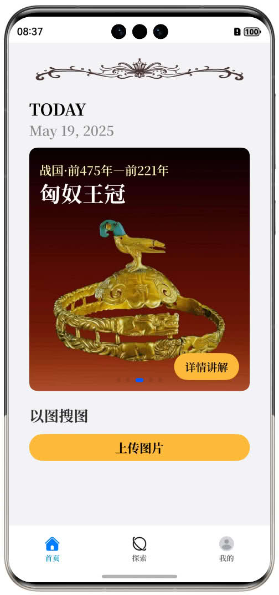
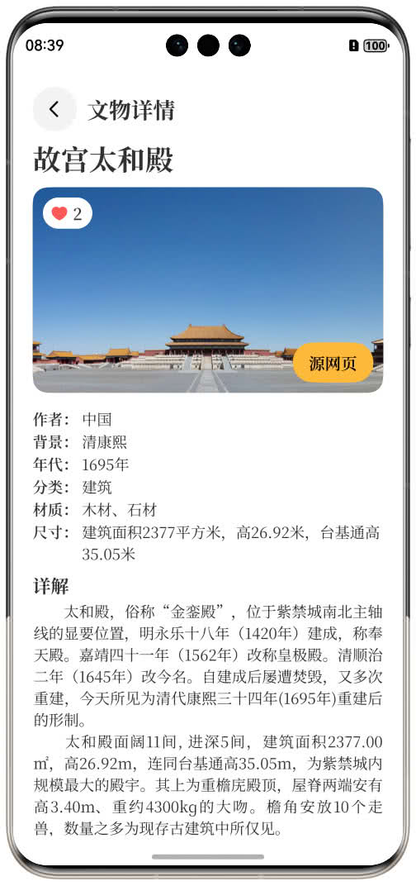
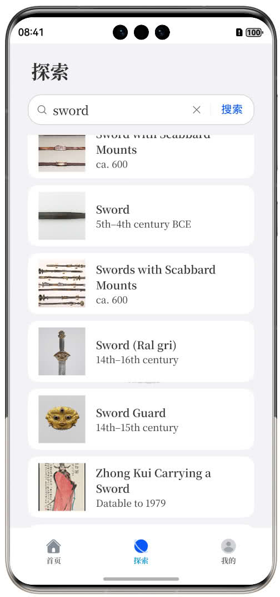
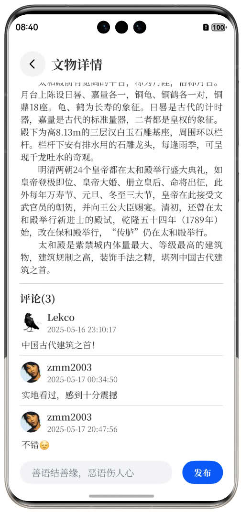
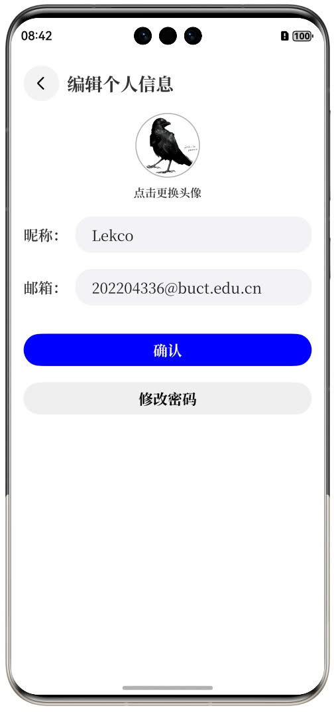
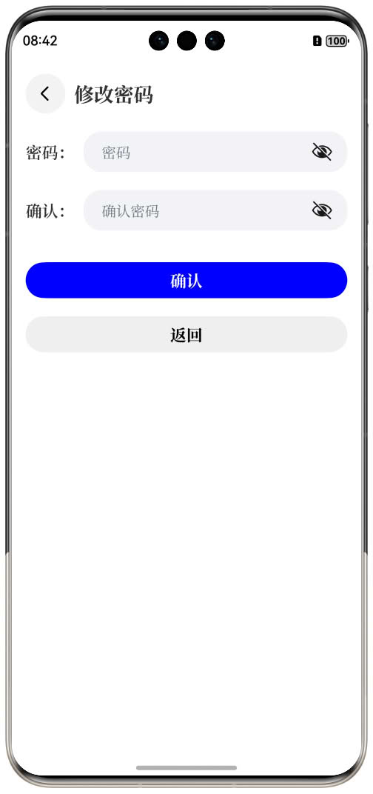

# 掌上博物馆 用户使用手册

欢迎使用掌上博物馆。这是一款专为文物爱好者和历史文化探索者打造的移动应用，帮助您随时随地欣赏文物、收听专业讲解等。以下内容将带您快速上手，每一个功能模块都有详细说明与操作步骤，让您轻松成为文物达人。

## 一、安装与启动

### 1. 下载与安装

- 在App Gallery搜索“掌上博物馆”，点击下载并安装。
- 安装过程仅需数十兆流量，完成后桌面会出现应用图标。

### 2. 启动应用

- 点击图标进入欢迎页，屏幕中央会出现 Logo 与简短动画。
- 动画结束后自动跳转至登录／注册界面，或在已登录的情况下直接进入首页。

## 二、邮箱/用户名 + 密码 登录

- 在登录页输入您的已注册邮箱或用户名。
- 在“密码”输入框输入对应密码，可点击“👁️”图标切换明文/掩码查看。

## 三、首页

### 1. 轮播图浏览

- 打开应用进入首页后，默认展示第一张文物轮播图；
- 左右滑动轮播图时，图片切换流畅，底部指示点同步更新；
- 点击“详情讲解”按钮，跳转至对应文物详情页。

### 2. 以图搜图

- 点击“上传图片”按钮，弹出相册或文件选择框；
- 选择图片后，进入识别搜索流程；
- 在结果页展示相关文物列表，点击任一条目进入详情页。

## 四、文物浏览

### 1. 文物详情

* 点击轮播图或列表条目进入详情页；
* 主图加载时，网络慢时先展示占位图，加载后平滑替换；
* 点击心形图标进行点赞/取消，点赞数实时更新并持久化；
* 点击“源网页”按钮，在浏览器打开原始链接；
* 在属性区查看“作者”、“年代”、“材质”等信息；
* 在“详解”区上下滑动阅读全文，支持长文本无卡顿。

### 2. 文物搜索

* 在搜索框输入关键词并回车或点击“搜索”，展示匹配列表；
* 点击“×”按钮可清空输入，恢复默认展示；
* 列表滑动时占位图与实际图平滑加载，无闪烁；
* 滑动到底部时，如有更多条目显示“加载更多”并追加，否则显示“已加载全部”；
* 点击条目进入详情页；无匹配时显示“未找到相关文物”提示。

### 3. 文物评论

* 在详情页评论框输入内容后点击“发送”，新评论追加到列表底部；
* 内容为空或超长（>500 字符）时禁止发送并提示；
* 点击评论点赞图标可点赞/取消，点赞数实时更新并持久化；
* 列表触底自动加载更多评论，全部加载后提示“已显示全部评论”；
* 网络异常时发送失败，保留内容并提示“发布失败，请重试”。

## 五、个人中心

### 1. 信息展示与编辑

* 页面顶部显示用户头像、昵称、邮箱，与登录信息保持一致；
* 点击头像或“编辑资料”按钮，可修改头像和昵称，保存后实时生效。

### 2. 我的收藏与足迹

* 在“我的收藏”或“历史记录”区下拉刷新加载数据，无新数据时提示“已是最新”；
* 点击条目进入对应文物详情页。

### 3. 设置与退出

* 点击“设置”图标进入修改密码、通知管理等选项；
* 点击“退出登录”按钮弹出确认框，确认后清除会话并跳转登录页。

### 4. 网络与错误

* 加载数据时网络异常，区域内显示错误信息，并提供“重试”按钮；
* 重试成功后恢复正常显示。

