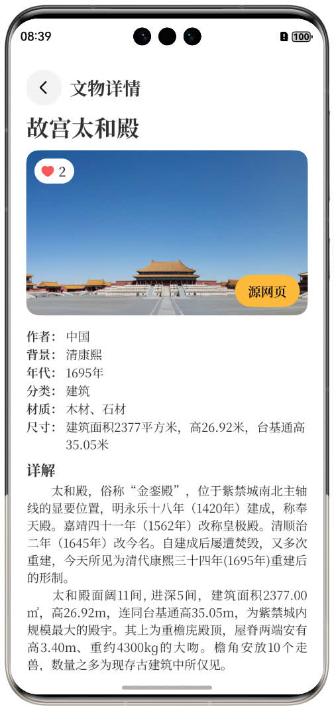
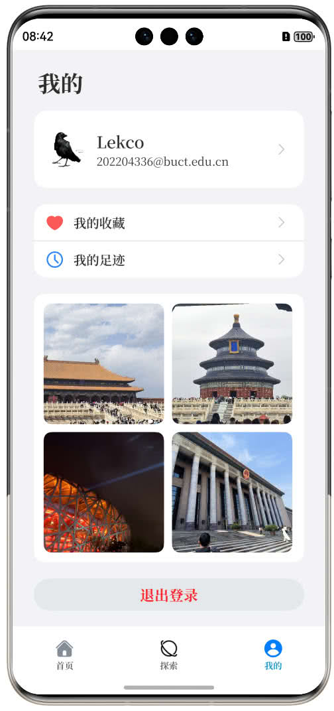
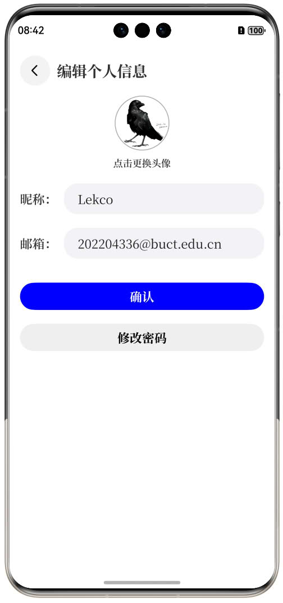

# 掌上博物馆 设计报告

## 一、概述

“掌上博物馆”是一款专为历史与文物爱好者打造的移动应用，它将传统博物馆的展览体验浓缩到手机屏幕之中，让用户在碎片化的时间里也能沉浸于文化的魅力。依托后台知识图谱技术，应用内涵盖瓷器、玉器、青铜器、中国画等典型单类文物，通过高清图文的方式，帮助用户随时随地了解每件藏品背后的故事。同时，融合类似微博的动态分享功能，鼓励用户发布观展感悟，点赞、评论和收藏他人的精彩瞬间，真正实现“边看边聊，边玩边学”。

## 二、设计目标

在设计之初，我们明确“易用性”与“沉浸感”是这款产品的两大核心指标。首先，任何不熟悉文物领域的普通用户，都能在首次打开应用后迅速找到心仪的藏品，并通过简洁明了的界面完成搜索、浏览和收听讲解的全流程；其次，通过优化图片展示和音频播放体验，营造出宛如身临其境的观展氛围，让用户仿佛穿梭于故宫、博物馆的殿堂内，静心欣赏每一件历经几百年风雨却依然绚烂如新的艺术珍品。

## 三、用户画像与需求

### 3.1 文物爱好者

- **特征**：平时习惯深度阅读，每遇到心仪藏品会细细研究背后的历史。
- **需求**：
  - 系统化的分类筛选（按朝代、类别、材质等）帮助快速定位目标藏品；
  - 高清多角度图集 + 专业语音讲解，节省自行查找资料的时间；
  - 收藏和笔记功能，让自己能为每件藏品做私人标注。

### 3.2 博物馆游客

- **特征**：偶尔外出参观，以手机拍照为主要记录方式，重视便捷性。
- **需求**：
  - “以图搜图”一键上传现场拍照，迅速匹配并获取文物解读；
  - 快速分享到社交平台，与好友即时分享“发现之美”。

### 3.3 学术研究者

- **特征**：关注文物的权威性与数据完整性，需要导出、引用功能。
- **需求**：
  - 详细的结构化元数据（出土地点、尺寸、材质、藏馆等）；
  - 包含进一步阅读链接，方便深入研究；
  - 关键词搜索，提升学术效率。

## 四、信息架构

### 4.1 登录/注册

**1. 邮箱/用户名 + 密码**：
  * 输入已注册的邮箱或用户名及对应密码完成身份验证；
  * 点击“👁️”图标可切换明文/掩码查看。

**2. 注册新账号**：
  * 在注册页输入邮箱与符合要求的密码（8–16位，包含字母、数字和符号中的至少2种）；
  * 点击“注册”后出现加载指示，成功后提示“注册成功”并跳转登录页；
  * 若邮箱格式不正确或已被注册，系统会给出相应校验或错误提示。

|||
|-|-|

### 4.2 首页

**1. 轮播图**：展示精选文物图片，左右滑动切换并支持快速跳转详情。

**2. 文物预览**：预览轮播图中的文物缩略图和标题。

**3. 详情讲解入口**：点击下方按钮进入该文物的详细介绍页面。

**4. 以图搜图**：上传或拍摄图片，系统自动识别并返回相似文物。
  * **上传图片**：选择本地或拍照上传目标图片。
  * **识别搜索流程**：后台进行图像分析并查询相关文物。
  * **结果列表**：展示所有匹配或相似文物条目，支持点击查看详情。

### 4.3 文物详情

* **主图展示**：高清展示文物主图，支持占位图及错误图处理。
* **点赞/取消点赞**：点击心形图标实时更新点赞数并保持用户偏好。
* **属性信息**：展示“作者”、“年代”、“材质”等核心信息。
* **详解文字**：提供文物背景与解读，支持长文本滚动。
* **源网页链接**：一键打开原始网页查看更丰富的资料。

### 4.4 文物搜索

* **关键词输入框**：输入关键字触发搜索。
* **清空按钮**：一键清除输入内容，恢复默认列表或空状态。
* **无结果提示**：无匹配时提示“未找到相关文物”，并支持重试。

### 4.5 文物评论

* **评论列表**：展示所有用户评论，支持上下滑动加载更多。
* **发表评论**：在输入框输入内容后点击“发送”按钮提交评论。
* **点赞/取消点赞**：对他人评论点赞或取消，点赞数即时更新。
* **网络异常及重试**：网络错误时提示失败并保留输入内容以便重试。

### 4.6 个人中心

* **用户信息**：顶部显示头像、昵称与联系方式，可编辑并实时更新。
* **我的收藏**：查看并管理已收藏文物，支持点击跳转详情。
* **我的足迹**：查看浏览过的文物足迹，支持下拉刷新与清空操作。
* **设置**：包括“修改密码”等，点击进入对应页面。
* **退出登录**：点击后弹出确认框，确认后清除会话并返回登录页。

||||
|-|-|-|

## 六、视觉与交互细节

配色方面，整体以现代简约的白色作为主基调，辅以黄铜色点缀重要按钮，使整体既契合博物馆的肃穆氛围，又不失现代应用的清新感。字体选用Noto Serif SC系列，既保证中文的易读性，也满足英文字体的流畅度。图标风格以简约线性为主，所有按钮都采用大圆角设计，并在触控状态下增加轻微阴影与缩放反馈，确保用户在手机屏幕上能够快速识别与点击。列表与详情页面留白充足，排版层次分明，避免信息过载，让用户在欣赏文物之余，视线始终集中于内容本身。

## 七、技术架构概览

## 八、项目进度安排

项目整体分为需求与设计、开发与联调、测试与上线三个阶段。需求与设计阶段预计一个星期，完成低／高保真原型与设计规范；开发与联调阶段设置为两至四周，涵盖前后端功能开发、接口文档编写与联调；测试与上线阶段为一周，包括功能测试、性能测试、安全测试及灰度发布。整个项目从立项到正式上线，预计在五周内高质量交付。
